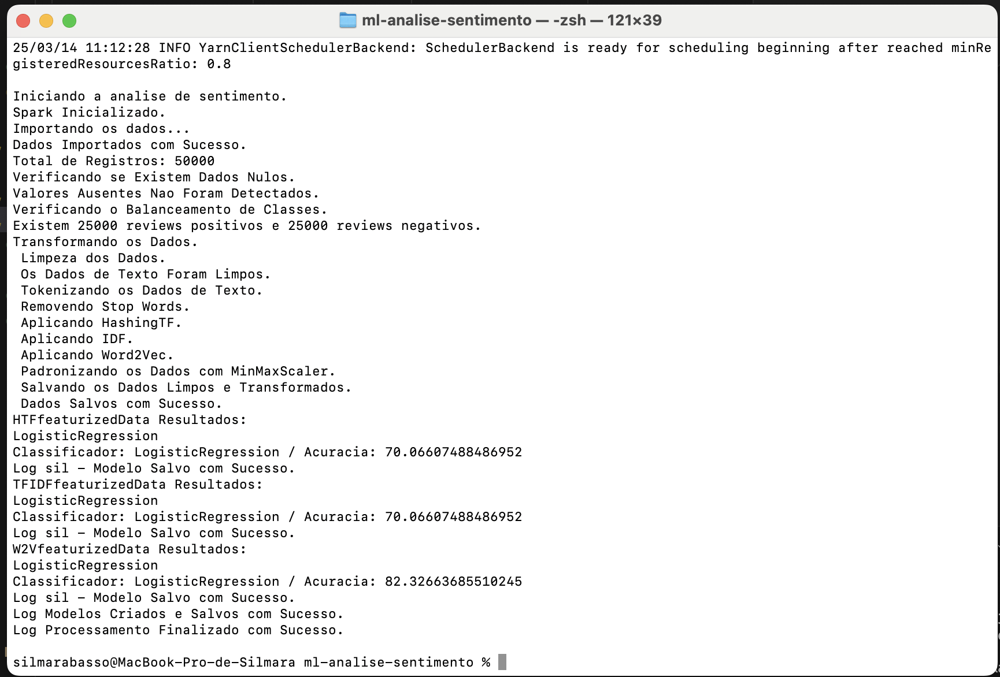

# ml-analise-sentimento
Experimentar 3 diferentes estratégias de pré-processamento para ver qual gera o modelo com melhor acurácia para a analise de sentimento

## Para iniciar o cluster

`docker compose -f docker-compose.yml up -d --scale spark-worker-yarn=3`

`docker compose logs`

# Testar o cluster
`docker exec sil-spark-master-yarn spark-submit --master yarn --deploy-mode cluster ./examples/src/main/python/pi.py`

# Execução

Usei o deploy mode como client para reduzir o consumo de memória RAM):

`docker exec sil-spark-master-yarn spark-submit --deploy-mode client ./apps/analise-sentimento.py`

## Analise do resultado:

`docker exec sil-spark-master-yarn hdfs dfs -ls /`

`docker exec sil-spark-master-yarn hdfs dfs -ls /opt`

`docker exec sil-spark-master-yarn hdfs dfs -ls /opt/spark`

`docker exec sil-spark-master-yarn hdfs dfs -ls /opt/spark/data`

`docker exec sil-spark-master-yarn hdfs dfs -ls /opt/spark/data/modelos`

`docker exec sil-spark-master-yarn hdfs dfs -ls /opt/spark/data/modelos/bestModel`

# Derrubar o cluster
`docker compose down --volumes --remove-orphans`